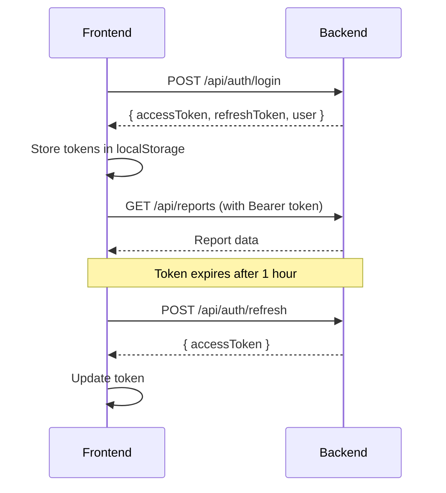

# Quick Start Guide - Backend Integration
## Maharashtra Water Billing System

---

## 🚀 Quick Setup (5 Minutes)

### 1. Install Dependencies

```bash
npm install axios
# or
yarn add axios
```

### 2. Configure Environment

```bash
# Copy environment template
cp .env.example .env.local

# Edit .env.local with your API URL
NEXT_PUBLIC_API_BASE_URL=http://localhost:5000
```

### 3. Test Connection

```typescript
// Test in browser console or create test file
import { get } from './services/api.service';

get('/api/health/check')
  .then(response => console.log('✅ Connected:', response))
  .catch(error => console.error('❌ Connection failed:', error));
```

---

## 📁 File Structure Overview

```
├── config/
│   └── api.config.ts          ← Update your API endpoints here
│
├── services/
│   ├── api.service.ts         ← Base API client (already configured)
│   ├── auth.service.ts        ← Login, logout, token management
│   ├── reports.service.ts     ← Report generation & export
│   ├── master.service.ts      ← Zones, wards, etc.
│   └── sms.service.ts         ← SMS functionality
│
├── hooks/
│   ├── useAuth.ts             ← Authentication state & functions
│   ├── useReports.ts          ← Report data fetching
│   └── useMasterData.ts       ← Master data (zones, wards)
│
└── types/
    └── api.types.ts           ← TypeScript interfaces
```

---

## 🔑 Backend Requirements

### Minimum Required Endpoints

#### 1. Authentication (Priority: HIGH)
```
POST   /api/auth/login
POST   /api/auth/refresh
GET    /api/auth/profile
POST   /api/auth/logout
```

#### 2. Master Data (Priority: HIGH)
```
GET    /api/master/zones
GET    /api/master/wards
GET    /api/master/wards/by-zone/{zoneId}
GET    /api/master/bill-types
GET    /api/master/connection-types
GET    /api/master/financial-years
```

#### 3. Reports (Priority: MEDIUM)
```
GET    /api/reports/list
POST   /api/reports/generate
GET    /api/reports/crm/top-defaulters
GET    /api/reports/collection/day-wise
```

#### 4. Export (Priority: MEDIUM)
```
GET    /api/reports/export/{reportId}?format=excel
```

---

## 📋 API Response Format

**All endpoints must return this format:**

```json
{
  "success": true,
  "data": { },
  "message": "Operation successful",
  "timestamp": "2024-12-03T10:30:00Z",
  "errors": []
}
```

---

## 🔧 Integration Examples

### Example 1: Login Integration

**Frontend Usage:**
```typescript
import { useAuth } from './hooks/useAuth';

function LoginPage() {
  const { login, isLoading, error } = useAuth();

  const handleSubmit = async (e) => {
    e.preventDefault();
    try {
      await login({
        username: 'admin',
        password: 'password123'
      });
      // Redirect to dashboard
      router.push('/dashboard');
    } catch (err) {
      console.error('Login failed:', err);
    }
  };

  return (
    <form onSubmit={handleSubmit}>
      {/* Login form */}
      {error && <div className="error">{error}</div>}
      <button disabled={isLoading}>
        {isLoading ? 'Logging in...' : 'Login'}
      </button>
    </form>
  );
}
```

**Backend Expected Response:**
```json
{
  "success": true,
  "data": {
    "accessToken": "eyJhbGci...",
    "refreshToken": "refresh_token",
    "expiresIn": 3600,
    "user": {
      "userId": "USR001",
      "userName": "admin",
      "fullName": "Admin User",
      "email": "admin@example.com",
      "role": "Administrator"
    }
  },
  "message": "Login successful",
  "timestamp": "2024-12-03T10:30:00Z"
}
```

### Example 2: Fetch Top Defaulters

**Frontend Usage:**
```typescript
import { useTopDefaulters } from './hooks/useReports';

function TopDefaultersReport() {
  const { data, isLoading, fetchTopDefaulters } = useTopDefaulters();

  useEffect(() => {
    fetchTopDefaulters({
      zoneId: 'ZONE_A',
      wardId: 'WARD_01',
      amountFrom: 10000
    });
  }, []);

  if (isLoading) return <div>Loading...</div>;

  return (
    <table>
      {data.map(defaulter => (
        <tr key={defaulter.consumerId}>
          <td>{defaulter.consumerNumber}</td>
          <td>{defaulter.consumerName}</td>
          <td>{defaulter.totalOutstanding}</td>
        </tr>
      ))}
    </table>
  );
}
```

**Backend Expected Response:**
```json
{
  "success": true,
  "data": {
    "items": [
      {
        "consumerId": "CON001",
        "consumerNumber": "WB123456",
        "consumerName": "John Doe",
        "address": "123 Main Street",
        "mobileNumber": "9876543210",
        "zoneId": "ZONE_A",
        "zoneName": "Zone A",
        "wardId": "WARD_01",
        "wardName": "Ward 1",
        "connectionType": "Residential",
        "totalOutstanding": 15000.50,
        "oldestBillDate": "2023-01-15T00:00:00Z",
        "billCount": 12,
        "status": "Active"
      }
    ],
    "totalCount": 150,
    "pageNumber": 1,
    "pageSize": 50,
    "totalPages": 3,
    "hasNextPage": true,
    "hasPreviousPage": false
  },
  "message": "Data retrieved successfully"
}
```

### Example 3: Master Data (Zones)

**Frontend Usage:**
```typescript
import { useMasterData } from './hooks/useMasterData';

function ZoneSelector() {
  const { zones, isLoading } = useMasterData();

  if (isLoading) return <div>Loading zones...</div>;

  return (
    <select>
      {zones.map(zone => (
        <option key={zone.zoneId} value={zone.zoneId}>
          {zone.zoneName}
        </option>
      ))}
    </select>
  );
}
```

**Backend Expected Response:**
```json
{
  "success": true,
  "data": [
    {
      "zoneId": "ZONE_A",
      "zoneCode": "ZA",
      "zoneName": "Zone A",
      "zoneNameMr": "झोन अ",
      "isActive": true
    },
    {
      "zoneId": "ZONE_B",
      "zoneCode": "ZB",
      "zoneName": "Zone B",
      "zoneNameMr": "झोन ब",
      "isActive": true
    }
  ],
  "message": "Zones retrieved successfully"
}
```

---

## 🔐 Authentication Flow



---

## ✅ Testing Checklist

### Phase 1: Basic Connectivity
- [ ] API server is running
- [ ] Health check endpoint works
- [ ] CORS is configured
- [ ] HTTPS is enabled (production)

### Phase 2: Authentication
- [ ] Login endpoint works
- [ ] JWT token is returned
- [ ] Token refresh works
- [ ] Logout works
- [ ] Invalid credentials return 401

### Phase 3: Master Data
- [ ] Zones endpoint returns data
- [ ] Wards endpoint returns data
- [ ] Wards by zone filter works
- [ ] Data format matches TypeScript types

### Phase 4: Reports
- [ ] Report list endpoint works
- [ ] Report generation with filters works
- [ ] Pagination works correctly
- [ ] Export to Excel works
- [ ] Export to PDF works

### Phase 5: Error Handling
- [ ] 404 errors are handled
- [ ] 500 errors show user-friendly messages
- [ ] Network errors are caught
- [ ] Validation errors show field messages

---

## 🐛 Troubleshooting

### Issue: CORS Error

**Error**: `Access to fetch at 'http://api...' from origin 'http://localhost:3000' has been blocked by CORS policy`

**Solution**: Add CORS configuration in your .NET backend:
```csharp
services.AddCors(options =>
{
    options.AddPolicy("AllowFrontend",
        builder =>
        {
            builder.WithOrigins("http://localhost:3000", "https://yourdomain.com")
                   .AllowAnyMethod()
                   .AllowAnyHeader()
                   .AllowCredentials();
        });
});

app.UseCors("AllowFrontend");
```

### Issue: 401 Unauthorized

**Solution**: Ensure JWT token is included in request headers:
```typescript
// This is handled automatically by api.service.ts
// Just ensure token is stored after login
```

### Issue: Slow API Response

**Solution**: 
1. Check network tab in browser DevTools
2. Optimize database queries
3. Implement caching on backend
4. Enable response compression (gzip)

### Issue: Data Format Mismatch

**Solution**: Ensure backend response matches TypeScript interfaces in `/types/api.types.ts`

---

## 📊 Performance Optimization

### 1. Caching Strategy
```typescript
// Master data is cached for 30 minutes
// Edit in services/master.service.ts
private readonly CACHE_DURATION = 30 * 60 * 1000;
```

### 2. Pagination
```typescript
// Always use pagination for large datasets
const { data, totalCount } = await reportsService.getTopDefaulters(
  filters,
  pageNumber,  // Default: 1
  pageSize     // Default: 50
);
```

### 3. Lazy Loading
```typescript
// Load data only when needed
useEffect(() => {
  if (isVisible) {
    fetchData();
  }
}, [isVisible]);
```

---

## 🆘 Common Questions

### Q: How do I add a new API endpoint?

1. Add endpoint to `/config/api.config.ts`
2. Create service method in appropriate service file
3. Create hook in `/hooks` if needed
4. Use in component

### Q: How do I handle file uploads?

Use the `uploadFile` function from `api.service.ts`:
```typescript
import { uploadFile } from './services/api.service';

const handleUpload = async (file: File) => {
  await uploadFile('/api/upload', file, { category: 'reports' });
};
```

### Q: How do I export reports?

```typescript
import { reportsService } from './services/reports.service';

await reportsService.exportReport(
  'report-id',
  'excel',  // or 'pdf', 'csv'
  filters,
  'MyReport.xlsx'
);
```

### Q: How do I handle errors globally?

Errors are handled automatically by `api.service.ts`. You can customize:
```typescript
// In api.service.ts - handleApiError function
function handleApiError(error: AxiosError<ApiResponse>): ApiError {
  // Custom error handling logic
}
```

---

## 📞 Need Help?

1. **Check Backend Logs**: Look for request details and errors
2. **Browser DevTools**: Network tab shows all API calls
3. **Console Logs**: Check for error messages
4. **TypeScript Errors**: Ensure types match between frontend/backend

---

## 🎯 Next Steps

1. ✅ Set up environment variables
2. ✅ Test authentication flow
3. ✅ Implement login page
4. ✅ Test master data endpoints
5. ✅ Integrate report components
6. ✅ Test export functionality
7. ✅ Deploy to staging
8. ✅ User acceptance testing
9. ✅ Deploy to production

---

**Happy Coding! 🚀**

---

**Last Updated**: December 3, 2024
